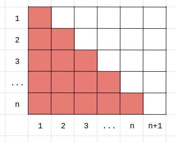

% Solution Writeup: Sum of Sum of Odds


# Sum of Sum of Odds  
## Solution Writeup

**Contest:** [TAMa 2023 Practice](https://noi.ph/tama-2023-practice-problems)  
**Problem Idea:** Cisco Ortega  
<!-- **Testing:** Cisco Ortega   -->
**Statement:** Cisco Ortega  
**Test Data Preparation:** Kevin Atienza  
**Solution Writeup:** Cisco Ortega  


<details class="editorial-section"><summary class="h2">Subtask 1</summary>

You can manually compute the value by hand, since $N=10$ is small enough.  Use a calculator to speed things up.

</details>


<details class="editorial-section"><summary class="h2">Subtask 2</summary>

Directly implement the function $f$ in code, and sum over all $n$ from $1$ to $N$.  Something like this:
```python
# pseudocode

N = 10**4
MOD = 10**6 + 37

function f(n):
    total = 0
    for k in 1, 2, 3, ..., n:
        total += 2*k - 1  # the kth odd
    return total

ans = 0
for n in 1, 2, 3, ..., N:
    ans += f(n)
print(ans % MOD)
```
You can count that this does $\approx N(N+1)/2$ addition operations (you can refer to the proof at the start of the "bonus" subsection of this solution sketch).  Even a slow language like Python can do on the order of $\approx 10^7$ operations per second, so this should terminate within a few seconds for the $N$ in subtask $2$.

</details>


<details class="editorial-section"><summary class="h2">Subtask 3</summary>

First, note that $f(n) = 1 + 3 + 5 + \dots + (\text{$n$th odd number}) = n^2$.  There are many ways to prove this fact, involving some classic visual proofs which the author finds quite beautiful.  For example:


Thus, we can speed up our code by replacing the loop in $f(n)$ with our magical formula.
```python
# pseudocode

N = 3**15
MOD = 10**6 + 37

function f(n):
    return (n * n) % MOD

ans = 0
for n in 1, 2, 3, ..., N:
    ans += f(n)
    ans %= MOD
print(ans)
```
Note also that we are now getting in the habit of reducing modulo $10^6 + 37$ at *each intermediate step*, instead of only right at the end, so that our numbers don't get too big.  Users of languages like C++ or Java must be extra vigilant about taking modulos whenever possible, in order to avoid integer overflow.

The number of operations is now roughly linear (i.e., directly proportional) to $N$.  So, with $N = 3^{15} \approx 1.4 \times 10^7$, this program should terminate in a few seconds.

</details>


<details class="editorial-section"><summary class="h2">Subtask 4</summary>

It has been revealed that our task, essentially, is to compute the sum $1^2 + 2^2 + 3^2 + \dots + N^2$.  This sum also has a well-known formula!  If you hadn't encountered it before, Googling "sum of squares formula" should show this:
$$1^2 + 2^2 + 3^2 + \dots + N^2 = \frac{N(N+1)(2N+1)}{6}$$

You can prove it using induction, although that does feel a bit magical.  At the end of this tutorial, just for fun, we'll present a way to derive this formula totally from scratch.

If you're using a language like Python, which allows for arbitrarily large integers, then all you have to do is implement this formula.
```python
# pseudocode

N = 3**15
MOD = 10**6 + 37

print((N*(N+1)*(2*N+1)//6) % MOD)
```

If you're using C++ or Java and are limited to $64$-bit integers, then the solution is a little bit more interesting.  The idea of "implement the formula" is the same, albeit with the extra caution of furiously taking modulos at every intermediate step in order to keep our numbers from getting too big.

 
```cpp
#include <iostream>
using namespace std;
typedef long long ll;

const ll MOD = 1e6 + 37;
const ll SIX_INV = (MOD+1)/6;

int main() {
    ll n; cin >> n;
    n %= MOD;

    ll ans = n;
    ans *= n+1; ans %= MOD;
    ans *= 2*n+1; ans %= MOD;
    ans *= SIX_INV; ans %= MOD;

    cout << ans << endl;
}
```

Of particular note is how we handle the division by $6$ in our formula, when it is not guaranteed that $N(N+1)(2N+1) \bmod (10^6+37)$ is divisible by $6$ after the modulo.

We instead multiply by the *multiplicative inverse of $6$*, i.e., an integer $x$ such that $6x \equiv 1 \pmod{10^6 + 37}$.

There are general algorithms for producing such a multiplicative inverse of any nonzero number if one exists (it helps that our modulus in prime), but in this particular case, it is easy to find $6^{-1}$ by inspection.

Let $m = 10^6 + 37$; note that $m + 1$ is divisible by $6$, and so $\frac{m+1}{6}$ is an integer. 
And in fact, $6^{-1} = \frac{m+1}{6}$ because $6~\frac{m+1}{6} \equiv 1 \pmod m$.

</details>


<details class="editorial-section"><summary class="h2">Bonus: The Sum of Squares Formula</summary>

The only prerequisite is some familiarity with manipulations in summation notation.

As a building block, we first need the fact that $1 + 2 + 3 + \dots + N = N(N+1)/2$.  This can also be proved visually, for example:



Now, consider the telescoping sum
$$\sum_{n=1}^N (n^3 - (n-1)^3),$$
i.e.
$$\begin{array}{cccccccc}
     N^3 & -(N-1)^3 &          &        &      &      & \\
         & +(N-1)^3 & -(N-2)^3 &        &      &      & \\
         &          & +(N-2)^3 & -(N-3)^3 &      &      & \\
         &          &&   \vdots &        &      &      & \\
         &          &&          & \vdots &      &      & \\
         &          &&          & +3^3    & -2^3 &      & \\
         &          &&          &        &  +2^3 & -1^3 & \\
         &          &&          &        &      &  +1^3 & - 0^2. \\
\end{array}$$
Written this way, it should hopefully be clear that many terms in this summation cancel out, thus we can say,
$$\sum_{n=1}^N (n^3 - (n-1)^3) = N^3 - 0.$$
Now, we perform some algebra.
$$\begin{align*}
    \sum_{n=1}^N (n^3 - (n-1)^3) &= N^3. \\
    \sum_{n=1}^N (3n^2 - 3n + 1) &= N^3. \\
    3 \sum_{n=1}^N n^2 - 3 \sum_{n=1}^N n + \sum_{n=1}^N 1 &= N^3. \\
    3 \sum_{n=1}^N n^2 - 3\frac{N(N+1)}{2} + N &= N^3. \\
    \sum_{n=1}^N n^2 &= \frac{1}{3} \left(N^3 + 3\frac{N(N+1)}{2} - N\right). \\
    \sum_{n=1}^N n^2 &= \frac{N(N+1)(2N+1)}{6}. \\
\end{align*}$$

<div class="task">
**Bonus:** This process generalizes well.  Use it to derive a simple polynomial formula for the sum of cubes up to $N$.
</div>

<div class="remarks">
**Remark:** The main ideas here can be used to derive formulas for any sum-of-powers summation.  Using strong induction, you can show that $\sum_{n=1}^N n^k$ is always a degree $k+1$ polynomial in terms of $N$&mdash;albeit for larger $k$, the coefficients become much messier to look at.
</div>

</details>
