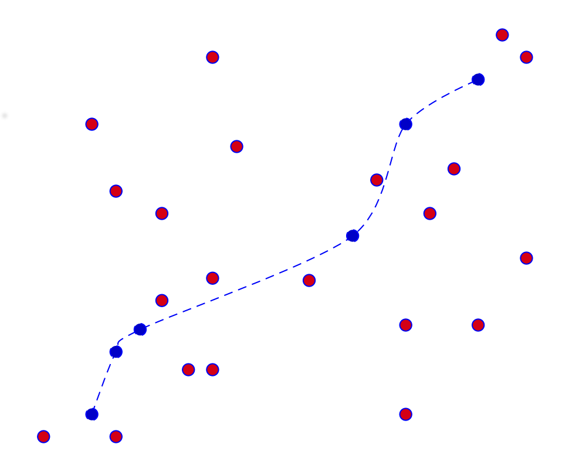
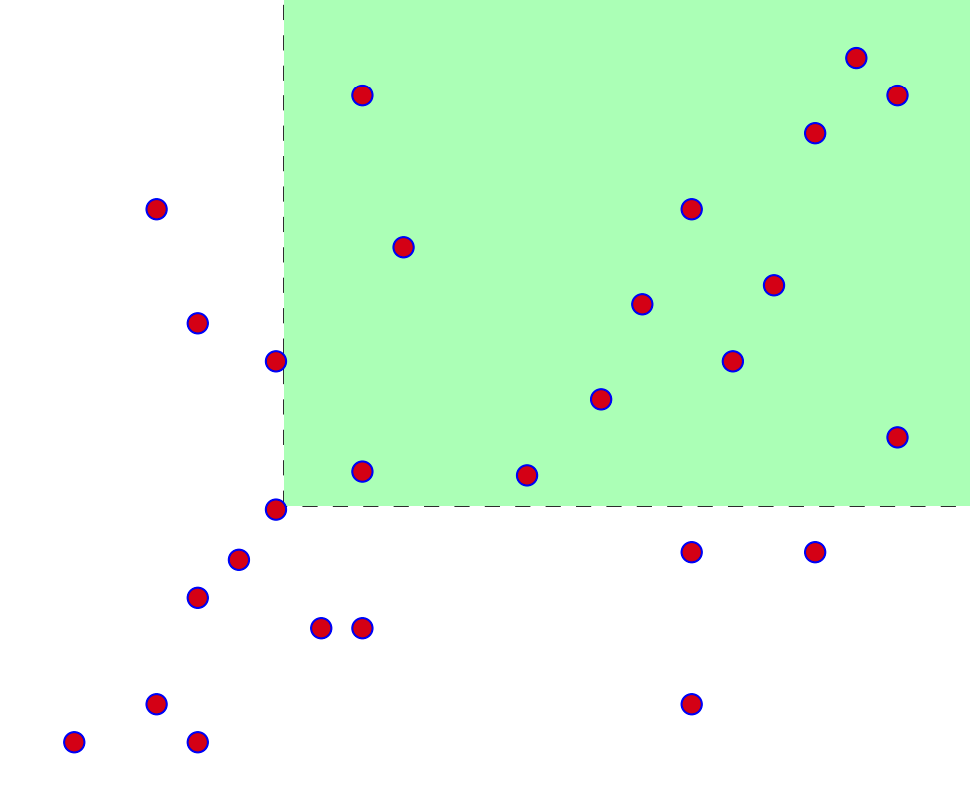

% Solution Writeup: The Amazons&rsquo; Primes


# The Amazons&rsquo; Primes  
## Solution Writeup

**Contest:** [TAMa 2023](https://noi.ph/tama-2023/)  
**Problem Idea:** Kevin Atienza  
**Testing:** Vincent dela Cruz, JL Allas  
**Statement:** Cisco Ortega  
**Test Data Preparation:** Kevin Atienza  
**Solution Writeup:** Kevin Atienza  


<details class="editorial-section"><summary class="h2">Subtask 1</summary>

### Brute force?

The input in the first subtask is small enough that **brute force** may be feasible.

One straightforward idea for a brute force solution would be to enumerate all possible sequences of numbers from $\{2, 3, \ldots, b-1\}$, and for each one, compute the corresponding Mini-sequences and Maxi-sequences and check whether the conditions $m_1 < m_2 < \ldots < m_n$ and $M_1 < M_2 < \ldots < M_n$ are satisfied.

Now, to compute the $m_i$ and $M_i$, we need to factorize the numbers. Since the numbers are only up to $47$, we can simply do this by brute force as well (and save the results).

Here&rsquo;s one possible way to implement it:
<details class="code"><summary class="h4">Code (Python)</summary>

```python
mod = 998_244_353

def is_prime(n):
    return n >= 2 and all(n % d != 0 for d in range(2, n))

def sequences(vs, n, curr=()):
    if n == 0:
        yield curr
    else:
        for v in vs:
            yield from sequences(vs, n - 1, (*curr, v))

def solve(n, b):
    # compute primes
    primes = [p for p in range(b) if is_prime(p)]

    # compute smallest and largest prime factors
    smallpf = [None]*b
    largepf = [None]*b
    for v in range(2, b):
        # find prime factors
        pfacs = [p for p in primes if v % p == 0]
        # save the smallest and largest
        smallpf[v] = min(pfacs)
        largepf[v] = max(pfacs)

    ans = 0
    for a in sequences(range(2, b), n):
        # compute Mini- and Maxi-sequences
        m = [smallpf[v] for v in a]
        M = [largepf[v] for v in a]
        # check if both are strictly increasing
        if (all(m1 < m2 for m1, m2 in zip(m, m[1:])) and
            all(M1 < M2 for M1, M2 in zip(M, M[1:]))):
            ans += 1

    return ans % mod
```
</details>
Here, we used backtracking to enumerate all sequences of numbers of length $n$ between $2$ and $b-1$. You can also just use [`itertools.product`](https://docs.python.org/3/library/itertools.html#itertools.product) to enumerate them more simply&mdash;it&rsquo;s just `product(range(2, b), repeat=n)`{.python}:

```python
from itertools import product
...
def solve(n, b):
    ...
    for a in product(range(2, b), repeat=n):
        ...
```
We can check that this is correct by running it on one of the examples, say $n = 3$ and $b = 18$.

Unfortunately, when you try to pass in the actual input $n = 10$ and $b = 48$, you&rsquo;ll find that it doesn&rsquo;t seem to finish. Indeed, there are $46$ possible values, which means there are $46^{10} \approx 4\cdot 10^{16}$ possible sequences. Even if we could process $10^9$ sequences per second, this program will take more than one year to finish!

We can improve this slightly with some observations.

- First, the numbers must be *distinct*, so we could just enumerate all sequences **without repeated values**. This reduces the number of candidates from $46^{10}$ to $46\cdot 45\cdot 44 \cdots 37$. However, this number is still large&mdash;it&rsquo;s $\approx 1.5\cdot 10^{16}$, which isn&rsquo;t a huge improvement. With $10^9$ sequences per second, our program would still take several months.

- Another insight would be to notice that for every set of $n$ distinct numbers, there is at most one ordering of them that could potentially work, because we want their largest (or smallest) prime factors to be increasing as well. So for every *set* of $n$ distinct numbers, we can simply **sort them by their largest prime factor**, and check if that ordering works. This reduces the number of candidates further to $\binom{46}{10} \approx 4\cdot 10^9$, which is much smaller than before, and the program may now be waitable.

- However, we can do even better than this. We could attempt to build the sequence number by number, and stop the construction **as soon as one of the conditions already fails**. 

    Specifically, the goal is to construct the sequence $[a_1, a_2, \ldots, a_n]$ number by number. At every point in the construction, we&rsquo;re attempting to choose the value of some $a_i$ between $2$ and $b-1$. We could just try each of them in turn, but we could do better: We know that $a_i$&rsquo;s smallest and largest prime factors must be larger than those of $a_{i-1}$&rsquo;s, so it&rsquo;s enough to only try the values with that property.

    After successfully choosing $n$ such numbers this way, we&rsquo;re guaranteed that the sequence we produced is valid (since we already checked all the necessary conditions), so the running time of this solution is now basically proportional to the number of sequences itself![^1] So we simply hope that there aren&rsquo;t too many of them that the program will finish quickly. And sure enough, if you implement and run this with $n = 10$ and $b = 48$, we find that it finishes in just a few seconds, even in Python!

Here&rsquo;s my implementation of that last idea in Python:
<details class="code"><summary class="h4">Code (Python)</summary>

```python
mod = 998_244_353

def is_prime(n):
    return n >= 2 and all(n % d != 0 for d in range(2, n))

def solve(n, b):
    # compute primes
    primes = [p for p in range(b) if is_prime(p)]

    # compute smallest and largest prime factors
    smallpf = [None]*b
    largepf = [None]*b
    for v in range(2, b):
        # find prime factors
        pfacs = [p for p in primes if v % p == 0]
        # save the smallest and largest
        smallpf[v] = min(pfacs)
        largepf[v] = max(pfacs)

    def count_sequences(curr):
        if len(curr) >= 2:
            # check that the last two numbers satisfy the condition
            a1, a2 = curr[-2:]
            if not (smallpf[a1] < smallpf[a2] and largepf[a1] < largepf[a2]):
                return 0

        if len(curr) == n:
            # we have constructed a full sequence
            return 1

        # otherwise, try all possible next values
        ans = 0
        for v in range(2, b):
            curr.append(v)
            ans += count_sequences(curr)
            curr.pop()

        return ans

    return count_sequences([]) % mod
```
</details>

### Pen and paper?

You could also solve this subtask with pen and paper by using the solution for Subtask 2, which is perfectly doable by hand.

</details>


<details class="editorial-section"><summary class="h2">Subtask 2</summary>

### Visualizing the problem

A fairly general advice I commonly give to people is to **draw a lot**.

For many problems that are clearly visual (such as geometry problems), this is obvious, but this advice still applies even to problems that aren&rsquo;t explicitly visual/geometrical, such as this problem.

Now, strictly speaking this isn&rsquo;t always needed, but in my experience, visualizing the problem has several benefits. For example, I find that visualizing often makes things easier to think about (since you can &ldquo;see&rdquo; the problem, and to an extent, it&rsquo;s &ldquo;more tangible&rdquo;). Also, I find that in many cases, it makes some insights easier to see. (We will see an example of this later on.) Humans have innate powerful spatial skills, and we should take advantage of that. 

So how do we make this problem geometric? Well, after thinking about it a bit, it becomes clear that the numbers between $1$ and $b$ don&rsquo;t really matter as much as their smallest and largest prime factors. Thus, rather than looking at the numbers $2, 3, \ldots, b-1$, we could say we&rsquo;re looking at the 2D **points** $(x_2, y_2), (x_3, y_3), \ldots, (x_{b-1}, y_{b-1})$, where

- $x_i$ is the largest prime factor of $i$, and
- $y_i$ is the smallest prime factor of $i$.

We can now rephrase the problem as follows. Recall that we want to find the number of sequences $(i_1, i_2, \ldots, i_n)$ of length $n$ such that:

- $x_{i_1} < x_{i_2} < \ldots < x_{i_n}$, and
- $y_{i_1} < y_{i_2} < \ldots < y_{i_n}$.

Now, &ldquo;$x < x'$ and $y < y'$&rdquo; is the same as saying that &ldquo;point $(x', y')$ is located northeast of point $(x, y)$.&rdquo; Thus, what we&rsquo;re really counting is the number of sequences of such points that are &ldquo;going northeast&rdquo;.



Here is now our problem, from a &ldquo;geometrical&rdquo; perspective:
<div class="task">
**Problem (Restated)**: Given a list of points $\left[(x_i, y_i) \mid 1 < i < b \right]$, how many sequences of $n$ such points are there that &ldquo;go northeast&rdquo;?
</div>


### Counting recursively

We&rsquo;re looking for sequences of points of length $n$ that go northeast. A straightforward way to build a sequence is to choose the points one by one, and we need only make sure that every point we choose is northeast of the previous point.

Well, the sequence has to start somewhere, so the first point must be any one of the $(x_i, y_i)$s, and we can write the answer as
$$\mathit{answer} = S(n, 2) + S(n, 3) + \ldots + S(n, b-1)$$
where $S(n, i)$ is the number of sequences of length $n$ that start at the point $(x_i, y_i)$. Writing the above in summation notation, it&rsquo;s the same as
$$\mathit{answer} = \sum_{i=2}^{b-1} S(n, i).$$
Let&rsquo;s now figure out how to compute $S(n, i)$. The first point is $(x_i, y_i)$, so the second point must be a point $(x_j, y_j)$ northeast of $(x_i, y_i)$ (that is, &ldquo;$x_i < x_j$ and $y_i < y_j$&rdquo;), so basically the remaining points form a valid sequence (of length $n - 1$) that starts at the point $(x_j, y_j)$. But we can count such sequences recursively&mdash;that&rsquo;s just $S(n-1, j)$ by definition! Thus, since the next point can be *any* such point $(x_j, y_j)$ northeast of $(x_i, y_i)$, we have the recurrence
$$S(n, i) = \sum_{\substack{j=2 \,\\ x_i < x_j \\ y_i < y_j}}^{b-1} S(n-1, j).$$
The base case should be simple:
<div class="task">
**Exercise:** Show that we can use the base case $S(1, i) = 1$.
</div>
Using this recurrence, we can now build a table of values of $S(n', i)$, for all $(n', i)$ such that $1 \le n' \le n$ and $1 < i < b$. We can build this table in increasing order of $n'$, because each entry $S(n', i)$ only depends on the &ldquo;previous layer&rdquo; (because the summands are $S(n' - 1, j)$), whose values we&rsquo;ve already computed. Finally, once we fill in the $n$th layer, we could then compute the answer using our summation formula above.

What&rsquo;s the running time of this solution? Well, there are $\approx nb$ possible arguments $(n', i)$, and each one is computed with a summation with $\approx b$ terms, so the amount of work is roughly $\approx nb\cdot b = nb^2$. (In algorithm parlance, we say that the running time is &ldquo;$\mathcal{O}(nb^2)$.&rdquo;) The amount of steps needed is small enough that this algorithm can be used to solve subtask 1 by hand (or maybe with a spreadsheet). For subtask 2, this is already quite waitable, but we can slightly speed it up by noticing that $S(n, i)$ doesn&rsquo;t really depend on $i$, only on $(x_i, y_i)$, so such values are equal for multiple points that happen to *coincide*. Formally, if $(x_i, y_i) = (x_j, y_j)$, then $S(n, i) = S(n, j)$. Using this, we only need to compute it once for every *distinct* point in $\{(x_i, y_i) \mid 1 < i < b \}$. This speeds up the running time from $\approx nb\cdot b$ steps to $\approx np\cdot b$ steps, where $p$ is the number of distinct points. (For $b = 4000$, you could check that $p = 1637$.)

This technique of building a table of results whose elements depend on earlier entries is called **dynamic programming**, or DP.

</details>


<details class="editorial-section"><summary class="h2">Subtasks 3 & 4</summary>


For the remaining subtasks, I&rsquo;ll only give hints. The previous solution is now too slow, so we need something faster. I&rsquo;ll give you a few hints that you can use to speed up your solution in different ways. A combination of some of them (plus maybe a few other insights) can be used to solve the remaining subtasks.

<details class="task"><summary class="h4">Hint 1 (Factoring faster)</summary>
There are faster ways to factorize all numbers up to $b$, e.g., by suitably modifying the [sieve of Eratosthenes](https://en.wikipedia.org/wiki/Sieve_of_Eratosthenes).
</details>

<details class="task"><summary class="h4">Hint 2 (Summing faster)</summary>
The $n$th &ldquo;layer&rdquo; of the table (&ldquo;layer $n$&rdquo;) can be computed based only off the previous layer (&ldquo;layer $n-1$&rdquo;). Now, each element $S(n, i)$ of the current layer is obtained from the previous layer as the sum across &ldquo;all points northeast of $(x_i, y_i)$&rdquo;. Graphically, if we write the numbers $S(n-1, i)$ on their locations $(x_i, y_i)$ in the 2D plane, then we&rsquo;re summing up a &ldquo;quadrant&rdquo;, e.g.,



It turns out that there are data structures that can speed this up! Such data structures preprocess a bunch of data like this so that after preprocessing, you can evaluate such &ldquo;range sums&rdquo; much more quickly than brute force. These cool **tree-based** data structures are fairly standard, and there are publicly available training materials discussing them, such as these training modules written by NOI.PH: [Trees](https://drive.google.com/file/d/1ZKVE8an5zEhyd3YYolK4BoQViawqEj9m/view?usp=drive_link), [DS1](https://drive.google.com/file/d/1hIirDnD-C--RVX7c8d6B6ScHcBbRb5ro/view?usp=drive_link), [DS2](https://drive.google.com/file/d/15q2WWAg2I1n5-MqHMKLm7BR7P4oYQZ-x/view?usp=drive_link) and [DS3](https://drive.google.com/file/d/17zd_VzBMJ0tfHue1tGAh5Qo4jpXNPPQJ/view?usp=drive_link).
</details>

<details class="task"><summary class="h4">Hint 3 (More insight on the data)</summary>
Our images above are just showing a bunch of random points for illustration purposes, but that may be misleading. Are our points *really* random? Try plotting the points $\left[(x_i, y_i) \mid 1 < i < b\right]$ and see...
</details>

The last two hints are the reason why I asked you to *visualize* the problem earlier on&mdash;those insights are much easier to see visually.

</details>

[^1]: Strictly speaking, there may be extra factors depending on our implementation, but we won&rsquo;t worry about those for now.
