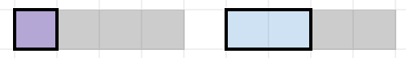
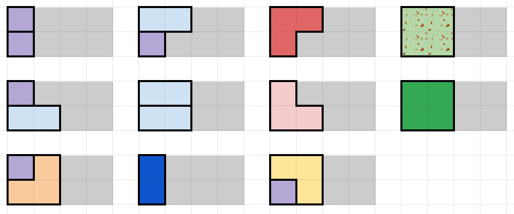
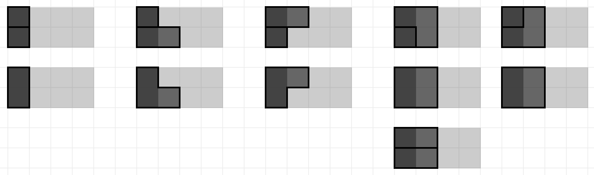
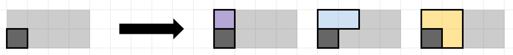
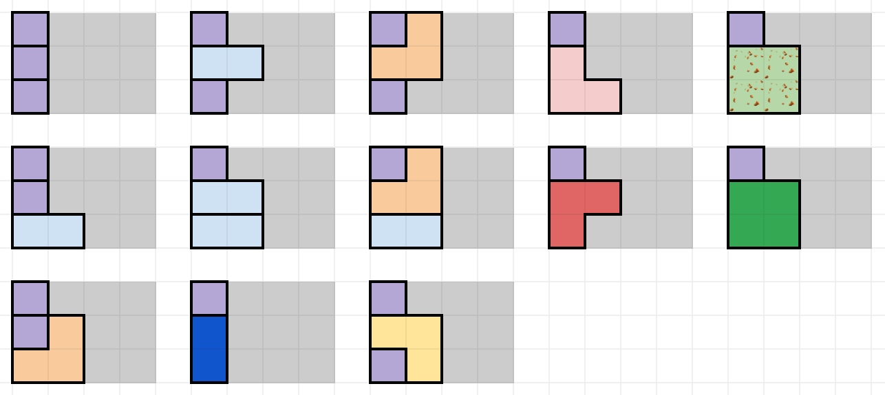

% Solution Writeup: Sweet Tile O&rsquo; Mine

# Sweet Tile O&rsquo; Mine  
## Solution Writeup

**Contest:** [TAMa 2023](https://noi.ph/tama-2023/)  
**Problem Idea:** Cisco Ortega  
**Testing:** Dylan Dalida, Vincent dela Cruz  
**Statement:** Cisco Ortega  
**Test Data Preparation:** Kevin Atienza  
**Solution Writeup:** Cisco Ortega  

Subtask 1

### The case $r=1$

Let&rsquo;s consider an even simpler case: What is the answer when $r=1$?  Note that the only tiles available to us in this case are the $1 \times 1$ square and $1 \times 2$ domino.

This is classic.  Consider the leftmost empty square&mdash;what will be placed there?  Either we place a $1 \times 1$ square there, or we place a $1 \times 2$ square there.  In either case, we are left with the problem of tiling the remaining $n-1$ columns (if $1 \times 1$) or $n-2$ columns (if $1 \times 2$)&mdash;which is the same as our original problem, but with smaller inputs.

Let $f(n)$ be the number of ways to tile a $1$-row Beast Bar with $n$ columns.  Then, we see that
$$
    f(n) = f(n-1) + f(n-2)
$$
with base cases $f(0) = f(1) = 1$.

**Bonus:** Compute the first few values of this sequence. Aren&rsquo;t these numbers familiar?

### The case $r=2$

Let&rsquo;s proceed similarly for the case where $r=2$.  Consider the leftmost empty column&mdash;it _has_ to be filled up somehow, so let&rsquo;s consider all the possible configurations of pieces that completely cover it.

There are eleven such ways.  It&rsquo;s more nontrivial to enumerate all of them (*and nontrivial to be certain that we didn&rsquo;t miss any*) but all we have to do is be systematic and split into cases.  What piece covers the first row?  Is it a $1 \times 1$, or a $1 \times 2$, or a $2 \times 1$, or a rotation of an L, or one of the $2 \times 2$s?  Carefully consider each possible case one by one.

Notice that some of these solutions &ldquo;incompletely&rdquo; cover the second column.  Instead of just $f(n)$, let&rsquo;s define _four_ functions $f_{00}, f_{01}, f_{10}$, and $f_{11}$ such that $f_s(n)$ determines the number of ways to completely tile a $2$-row Beast Bar with $n$ columns _if_ there is some garbage in the leftmost column (as determined by the subscript)&mdash;the first character is `1` if there is garbage in the first row, and `0` otherwise; likewise with the second character.

We can go back and partition those eleven different ways according to the garbage they leave in the following column.

Thus, we say:
$$
    f_{00}(n) = 2 f_{00}(n-1) + 2 f_{01}(n-1) + 2 f_{10}(n-1) + 5 f_{11}(n-1).
$$
We consider all ways to tile the first column, and then we&rsquo;re left with the task of tiling the rest of the Beast Bar (with maybe some garbage in that first column, which we remember to account for).

Let&rsquo;s proceed with the other cases.  What can you do when there&rsquo;s a single square of garbage on the bottom row?

which similarly means,
$$
    f_{01}(n) = f_{00}(n-1) + f_{10}(n-1) + f_{11}(n-1).
$$

By symmetry, the case when there&rsquo;s a single square of garbage in the top row is similar:
$$
    f_{10}(n) = f_{00}(n-1) + f_{01}(n-1) + f_{11}(n-1).
$$

Finally, if we want to tile $n$ columns but the entirety of the leftmost column is filled with garbage&mdash;well, that&rsquo;s the same as tiling $n-1$ columns (with a clean leftmost column):
$$
    f_{11}(n) = f_{00}(n-1).
$$

Note that this tactic of, &ldquo;We only need to keep track of the garbage in the leftmost column,&rdquo; works because our tiles **all have a width of at most 2 squares**&mdash;so tiles placed to cover a square in the leftmost column can only affect up to one column over.

If $c$ is small (and $c=8$ is small enough that you can even do this by hand), then what we can do is create a table with four rows (labeled `00` and `01` and `10` and `11`) and $c+1$ columns (labeled $0$ to $c$) such that the cell in the row labeled $s$ and the column labeled $n$ contains the value $f_s(n)$.  Then, you can populate the table from left-to-right, calculating the values that go in each column by using the values in the previous column.

- What is our base case?  What should be the values of $f_{00}(0)$ and $f_{01}(0)$ and $f_{10}(0)$ and $f_{11}(0)$?
- Once the table has been fully populated&mdash;which cell contains our answer?

Subtask 2

### The case $r=3$

The case for when $r=3$ is pretty much the same as the $r=2$ case, with the only exception being that we now have to keep track of $2^3 = 8$ possible states for how garbage is placed in the leftmost column.  

Also, there are even more different ways to cover the first column, but it&rsquo;s still not too hard to enumerate all of them by hand.  Again, just be very systematic with your casework.

- Suppose we place a $1 \times 1$ square in the topmost row.  Now, exhaust all the ways to place tiles in the remaining rows...
    - Suppose we place a $1 \times 1$ square in the next row.  Now, exhaust all the ways to place tiles in the remaining row...
    - After that, suppose we place a $1 \times 2$ domino in the next row.  Now, exhaust all the ways to place tiles in the remaining row...
    - After that, suppose we place a $2 \times 1$ domino in the next row.  Now, exhaust all the ways to place tiles in the remaining row...
    - ...
- After that, suppose we place a $1 \times 2$ square in the topmost row.  Now, exhaust all the ways to place tiles in the remaining rows...
- ...

It may seem like a lot of work, but I promise that with careful bookkeeping and meticulous enumeration, you should be done with just a few minutes of active effort.  Don&rsquo;t underestimate how much time and grief can be saved by just being organized!

Here, we&rsquo;ve decided to help you get started!  These are all the ways to cover the first column with tiles, assuming the first column has no garbage, _and we place a $1 \times 1$ square in the topmost row_.

You&rsquo;ll find that the &ldquo;has no garbage in the first column&rdquo; `000` case will take up the bulk of your work.  When there is garbage in the first row, your options for placing tiles will get severely more limited, and you&rsquo;ll finish enumerating all the possibilities much more quickly.

Anyway, when you&rsquo;re done, you can construct eight interdependent recurrence relations $f_{000}$, $f_{001}$, $f_{010}$, $f_{011}$, $f_{100}$, $f_{101}$, $f_{110}$, and $f_{111}$, similarly to what we did for subtask $1$.

Then, again construct the $2^3 \times (c+1)$ table.  Populate the table from left-to-right, computing the values that go in each column using the values in the previous column.  Of course, you should use a computer to do this instead of doing it by hand, perhaps representing the table as $8$ lists.  Because $8 \times (10^6+1) < 10^8$, we will still comfortably be within our $1$ minute time limit.

Subtask 3

The eight functions $f_{000}$, $f_{001}$, $f_{010}$, $f_{011}$, $f_{100}$, $f_{101}$, $f_{110}$, and $f_{111}$ are so interdependent that it makes sense to &ldquo;bundle&rdquo; them together into one vector.

With the language of vector addition and scalar multiplication, you can check that the eight recurrence relations can be written in the following way:
$$
\small
    \begin{bmatrix}
        f_{000}(n+1) \\
        f_{001}(n+1) \\
        f_{010}(n+1) \\
        f_{011}(n+1) \\
        f_{100}(n+1) \\
        f_{101}(n+1) \\
        f_{110}(n+1) \\
        f_{111}(n+1)
    \end{bmatrix}
    = 
    f_{000}(n)\!\begin{bmatrix}
        3 \\
        2 \\
        1 \\
        1 \\
        2 \\
        1 \\
        1 \\
        1 \\
    \end{bmatrix}
    +
    f_{001}(n)\!\begin{bmatrix}
        3 \\
        0 \\
        1 \\
        0 \\
        2 \\
        0 \\
        1 \\
        0 \\
    \end{bmatrix}
    +
    f_{010}(n)\!\begin{bmatrix}
        3 \\
        2 \\
        0 \\
        0 \\
        2 \\
        1 \\
        0 \\
        0 \\
    \end{bmatrix}
    +
    f_{011}(n)\!\begin{bmatrix}
        7 \\
        1 \\
        1 \\
        0 \\
        5 \\
        1 \\
        1 \\
        0 \\
    \end{bmatrix}
    +
    f_{100}(n)\!\begin{bmatrix}
        3 \\
        2 \\
        1 \\
        1 \\
        0 \\
        0 \\
        0 \\
        0 \\
    \end{bmatrix}
    +
    f_{101}(n)\!\begin{bmatrix}
        3 \\
        0 \\
        1 \\
        0 \\
        0 \\
        0 \\
        0 \\
        0 \\
    \end{bmatrix}
    +
    f_{110}(n)\!\begin{bmatrix}
        7 \\
        5 \\
        1 \\
        1 \\
        1 \\
        1 \\
        0 \\
        0 \\
    \end{bmatrix}
    +
    f_{111}(n)\!\begin{bmatrix}
        11 \\
        1 \\
        1 \\
        0 \\
        1 \\
        0 \\
        0 \\
        0 \\
    \end{bmatrix}.
$$
Let $T$ be a function that accepts an $8$-element vector and outputs another $8$-element vector, defined as:
$$
\begin{align*}
    T\left(\begin{bmatrix}
        v_0 \\
        v_1 \\
        v_2 \\
        v_3 \\
        v_4 \\
        v_5 \\
        v_6 \\
        v_7 \\
    \end{bmatrix}
    \right) =
    v_0 \begin{bmatrix}
        3 \\
        2 \\
        1 \\
        1 \\
        2 \\
        1 \\
        1 \\
        1 \\
    \end{bmatrix}
    +
    v_1 \begin{bmatrix}
        3 \\
        0 \\
        1 \\
        0 \\
        2 \\
        0 \\
        1 \\
        0 \\
    \end{bmatrix}
    +
    v_2 \begin{bmatrix}
        3 \\
        2 \\
        0 \\
        0 \\
        2 \\
        1 \\
        0 \\
        0 \\
    \end{bmatrix}
    +
    v_3 \begin{bmatrix}
        7 \\
        1 \\
        1 \\
        0 \\
        5 \\
        1 \\
        1 \\
        0 \\
    \end{bmatrix}
    +
    v_4 \begin{bmatrix}
        3 \\
        2 \\
        1 \\
        1 \\
        0 \\
        0 \\
        0 \\
        0 \\
    \end{bmatrix}
    +
    v_5 \begin{bmatrix}
        3 \\
        0 \\
        1 \\
        0 \\
        0 \\
        0 \\
        0 \\
        0 \\
    \end{bmatrix}
    +
    v_6 \begin{bmatrix}
        7 \\
        5 \\
        1 \\
        1 \\
        1 \\
        1 \\
        0 \\
        0 \\
    \end{bmatrix}
    +
    v_7 \begin{bmatrix}
        11 \\
        1 \\
        1 \\
        0 \\
        1 \\
        0 \\
        0 \\
        0 \\
    \end{bmatrix}.
\end{align*}
$$
Rewriting what has already been written:
$$
\begin{align*}
    T\left(
    \begin{bmatrix}
        f_{000}(n) \\
        f_{001}(n) \\
        f_{010}(n) \\
        f_{011}(n) \\
        f_{100}(n) \\
        f_{101}(n) \\
        f_{110}(n) \\
        f_{111}(n)
    \end{bmatrix}
    \right)
    =
    \begin{bmatrix}
        f_{000}(n+1) \\
        f_{001}(n+1) \\
        f_{010}(n+1) \\
        f_{011}(n+1) \\
        f_{100}(n+1) \\
        f_{101}(n+1) \\
        f_{110}(n+1) \\
        f_{111}(n+1)
    \end{bmatrix}.
\end{align*}
$$
In a sense, $T$ is a **&ldquo;transition&rdquo;** function.  When we apply it to a vector containing our bundle of $f_{s}(n)$ functions, it &ldquo;advances all of them forward&rdquo; by $+1$.  To get the answer that we want:
$$
\begin{align*}
    \underbrace{T(T(T\dots T}_{c~\text{times}}\left(
    \begin{bmatrix}
        f_{000}(0) \\
        f_{001}(0) \\
        f_{010}(0) \\
        f_{011}(0) \\
        f_{100}(0) \\
        f_{101}(0) \\
        f_{110}(0) \\
        f_{111}(0)
    \end{bmatrix}
    \right)\dots )))
    =
    \begin{bmatrix}
        f_{000}(c) \\
        f_{001}(c) \\
        f_{010}(c) \\
        f_{011}(c) \\
        f_{100}(c) \\
        f_{101}(c) \\
        f_{110}(c) \\
        f_{111}(c)
    \end{bmatrix}.
\end{align*}
$$

If you&rsquo;re aware of linear transformations (vector-functions that have the form of $T$), then you know that $T$ can be written as a **matrix**, and the function
$$
    \underbrace{T\circ T\circ T\circ \dots \circ T}_{c~\text{times}}
$$
can be evaluated in $\approx \log_2 (c)$ matrix multiplications using any fast exponentiation algorithm.

Subtasks 4 & 5

For $r=7$, just do the same thing that we had done previously, except the difference is that you should use **code** to determine the transition function $T$, instead of doing it by hand.  The idea is still the same though&mdash;try placing some tile in the topmost row, recurse on the remaining rows, then backtrack and try placing a different tile there (and again recursing on the remaining rows).  This idea is called **recursive backtracking**.

Each matrix multiplication takes roughly $(2^7)^3$ steps, and we can still afford to do $\log_2(10^{18})$ such operations for Subtask 5.

